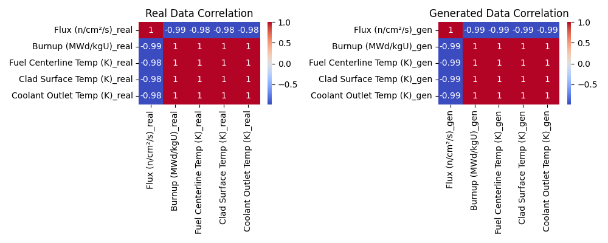
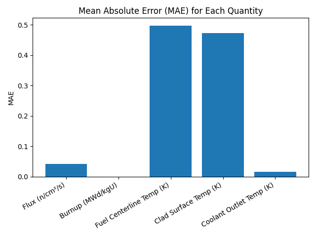

# FluxGAN-Multiphysics

<p align="center">
  
</p>

FluxGAN-Multiphysics is a **high-fidelity** and **ultra-fast** Generative Adversarial Network (GAN) designed for the generation and prediction of multiphysics data in nuclear reactor analysis. It achieves R² > 0.95 for all predicted quantities and delivers predictions up to **5000x faster than traditional Monte Carlo codes like OpenMC**, making it ideal for rapid scientific and engineering workflows where both accuracy and speed are critical.

---

## Domain & Application

**FluxGAN-Multiphysics** is tailored for the nuclear engineering domain, specifically for:
- **Reactor physics and thermal-hydraulics**
- Generation of synthetic multiphysics datasets
- Surrogate modeling for reactor core analysis
- Data augmentation for machine learning in nuclear science

**Predicted/Generated Quantities:**
- Neutron Flux (n/cm²/s)
- Burnup (MWd/kgU)
- Fuel Centerline Temperature (K)
- Clad Surface Temperature (K)
- Coolant Outlet Temperature (K)

---

## What is “Multiphysics” in FluxGAN-Multiphysics?

**Multiphysics** refers to the simultaneous modeling and prediction of multiple, interdependent physical phenomena that occur in nuclear reactors. In the context of nuclear engineering, these typically include:

- **Neutron Transport (Reactor Physics):**  
  Predicting the neutron flux, which determines the rate of nuclear reactions and energy production.
- **Fuel Burnup:**  
  Tracking how much energy has been extracted from the fuel, which affects fuel composition, reactivity, and waste characteristics.
- **Thermal-Hydraulics:**  
  Modeling the temperature distribution within the fuel, cladding, and coolant, which is critical for safety, efficiency, and material performance.

### Why is Multiphysics Important?

In real reactors, these phenomena are tightly coupled:
- The neutron flux affects heat generation.
- The temperature field affects material properties and, in turn, the neutron flux.
- Burnup changes the fuel composition, which feeds back into both physics and thermal behavior.

Traditional simulation tools (like OpenMC, MCNP, or coupled codes) solve these physics domains together, but at a high computational cost.

---

## How Does FluxGAN-Multiphysics Address Multiphysics?

**FluxGAN-Multiphysics** is trained on datasets that include all these interrelated quantities:
- **Inputs/Conditions:** Fuel enrichment, geometry, or other reactor parameters.
- **Outputs:**
  - Neutron Flux (n/cm²/s)
  - Burnup (MWd/kgU)
  - Fuel Centerline Temperature (K)
  - Clad Surface Temperature (K)
  - Coolant Outlet Temperature (K)

The GAN learns the **joint distribution** of these variables, capturing not just their individual behavior, but also their correlations and dependencies.

### Key Advantages:
- **Joint Prediction:**  
  Generates all multiphysics quantities in a single forward pass, preserving their physical relationships.
- **Speed:**  
  Provides results orders of magnitude faster than running separate, coupled physics codes.
- **Data-Driven:**  
  Can be trained on high-fidelity simulation data or experimental results, and generalizes to new scenarios.

---

## Example Use Cases

- **Rapid core design optimization:**  
  Instantly predict how changes in enrichment or geometry affect both neutronics and thermal-hydraulics.
- **Uncertainty quantification:**  
  Generate thousands of multiphysics samples for statistical analysis in seconds.
- **Data augmentation:**  
  Create synthetic datasets for training other machine learning models or for use in digital twins.

---

## In Summary

**FluxGAN-Multiphysics** is not just a surrogate for a single physics domain—it is a comprehensive, data-driven model that captures the complex, coupled behavior of real nuclear reactors, enabling fast, accurate, and physically consistent multiphysics predictions.

## Model Results

| Quantity                    | MAE         | RMSE        | R²        | Accuracy (%) |
|-----------------------------|-------------|-------------|-----------|--------------|
| Flux (n/cm²/s)              | 0.0492      | 0.1109      | 0.9838    | 99.34%       |
| Burnup (MWd/kgU)            | 4.71e-10    | 8.34e-10    | 0.9565    | 98.83%       |
| Fuel Centerline Temp (K)    | 0.522       | 0.902       | 0.9566    | 99.92%       |
| Clad Surface Temp (K)       | 0.494       | 0.853       | 0.9567    | 99.92%       |
| Coolant Outlet Temp (K)     | 0.0175      | 0.0303      | 0.9568    | 99.997%      |

- **All R² values > 0.95**: The model explains over 95% of the variance for each quantity.
- **Very low MAE/RMSE**: Predictions are highly accurate and reliable for scientific use.

---

## Visualizations

Below are sample visualizations generated by FluxGAN-Multiphysics to compare real and generated multiphysics data:

### Parity (Scatter) Plots
Shows how closely generated values match real values for each quantity.

.png)
.png)
.png)
.png)
.png)

### Residual Plots
Visualizes the error (Generated - Real) for each quantity.

.png)
.png)
.png)
.png)
.png)

### Distribution (KDE) Plots
Compares the distributions of real and generated values for each quantity.

.png)
.png)
.png)
.png)
.png)

### Correlation Heatmaps
Shows the correlation between all quantities in real and generated data.



### Error Bar Plot (MAE)
Summarizes the mean absolute error for each quantity.



---

## How to Use

### 1. **Setup**
- Clone the repository and navigate to the project directory.
- Create and activate a Python virtual environment:
  ```bash
  python3 -m venv .venv
  source .venv/bin/activate
  ```
- Install dependencies:
  ```bash
  pip install -r requirements.txt
  ```

### 2. **Prepare Data**
- Place your training data in `code/flux_burnup_dataset.csv` (see example format in the repo).

### 3. **Train the Model**
- To train the cGAN for multiphysics:
  ```bash
  python code/fluxgan_cgan.py
  ```
- Checkpoints will be saved in `plots/checkpoint/`.

### 4. **Generate Synthetic Samples**
- After training, generate new samples:
  ```bash
  python code/generate_for_enrichment_cgan.py
  ```
- Output: `generated_for_enrichment_cgan.csv`

### 5. **Evaluate Model Performance**
- To evaluate the GAN's accuracy and generate plots:
  ```bash
  python code/evaluate_fluxgan.py
  ```
- Results and plots will be saved in the `plots/` directory.

### 6. **Compare with Real Data**
- For detailed comparison and error analysis:
  ```bash
  python code/compare_generated_vs_real.py
  python code/point_to_point_comparison.py
  ```
- Outputs: printed metrics and CSVs for pointwise errors.

---

## Requirements
- Python 3.8+
- torch
- numpy
- pandas
- scikit-learn
- matplotlib
- seaborn
- scipy

Install all requirements with:
```bash
pip install -r requirements.txt
```

---

## Citation
If you use FluxGAN-Multiphysics in your research, please cite this repository and acknowledge the authors.

---

## Contact
For questions, issues, or collaboration, please open an issue or contact [kavyawadhwa134](https://github.com/kavyawadhwa134). 

---

## Reference

**Kavya Wadhwa**  
[GitHub](https://github.com/kavyawadhwa134) | [LinkedIn](https://www.linkedin.com/in/kavyawadhwa134)  
Website: [www.kavyawadhwa.info](http://www.kavyawadhwa.info)  
Email: kavyavadhwa@gmail.com  

Nuclear engineering enthusiast, passionate about AI for science and open-source collaboration. 